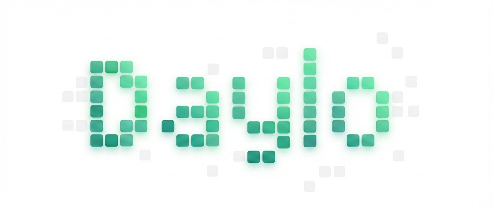
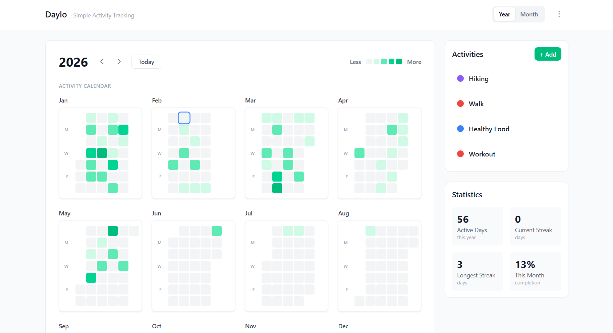
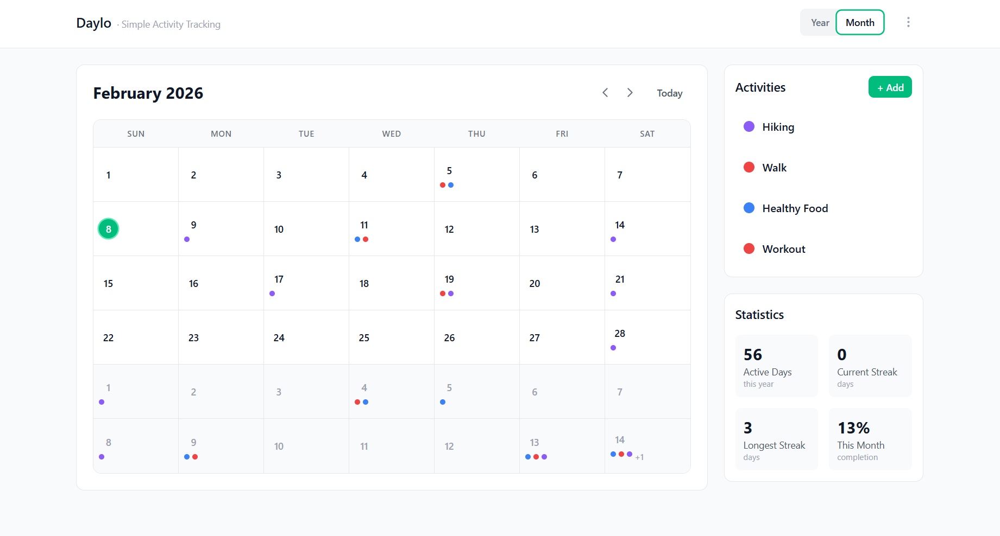

<p align="center">
  
</p>

<p align="center">
  A personal activity tracker with a GitHub-style contribution calendar.<br/>
  Track daily habits, visualize progress with a heatmap, and stay on top of your goals — all locally, no account required.
</p>

<p align="center">
  <a href="#installation">Install</a> &nbsp;&middot;&nbsp;
  <a href="#features">Features</a> &nbsp;&middot;&nbsp;
  <a href="#screenshots">Screenshots</a> &nbsp;&middot;&nbsp;
  <a href="#tech-stack">Tech Stack</a>
</p>

<p align="center">
  
</p>

## Installation

Daylo runs entirely on your device — no account, no cloud, no tracking.

- **[Desktop app](#desktop-app)** (Windows, macOS, Linux) — Download from GitHub Releases
- **[Docker](#docker)** — Self-hosted via `docker compose`
- **[From source](#from-source)** — Clone and build

## Features

- **Annual heatmap view** — See your entire year at a glance with a 5-level color heatmap
- **Monthly detail view** — Drill down into any month with activity dots per day
- **Quick daily logging** — Click any day to check off completed activities
- **Activity management** — Create, edit, and delete activities with custom colors
- **Statistics** — Current streak, longest streak, monthly completion rate
- **Export/Import** — Back up your data as JSON or CSV, restore from backup
- **Offline-first** — All data stays on your device, works 100% offline
- **Cross-platform** — Runs as a desktop app (Windows, macOS, Linux) or in the browser

## Screenshots

<p align="center">
  
</p>
<p align="center"><sub>Year View — See your entire year at a glance</sub></p>

<br/>

<p align="center">
  
</p>
<p align="center"><sub>Month View — Drill down into any month</sub></p>

## Tech Stack

| Layer | Technology |
|-------|-----------|
| Frontend | React 19, TypeScript, Vite 7 |
| Styling | Tailwind CSS 4 |
| State | Zustand 5 (persisted to localStorage) |
| Desktop | Tauri 2 |
| Testing | Vitest + Testing Library (unit), Playwright (E2E) |
| CI/CD | GitHub Actions |

---

### Desktop App

Download the latest release for your platform from the [Releases](../../releases) page:

| Platform | File |
|----------|------|
| Windows | `Daylo_x.x.x_x64-setup.exe` |
| macOS (Apple Silicon) | `Daylo_x.x.x_aarch64.dmg` |
| macOS (Intel) | `Daylo_x.x.x_x64.dmg` |
| Linux (Debian/Ubuntu) | `Daylo_x.x.x_amd64.deb` |
| Linux (Other) | `Daylo_x.x.x_amd64.AppImage` |

Just install and open — no setup, no accounts, no internet required.

### Docker

Run Daylo as a local web service with a single command. Requires [Docker](https://docs.docker.com/get-docker/).

```bash
docker compose up -d
```

Open `http://localhost:3000` in your browser.

### From Source

Requires [Node.js](https://nodejs.org/) 20+.

```bash
git clone https://github.com/henfrydls/daylo.git
cd daylo
npm install
npm run dev
```

Open `http://localhost:5173` in your browser.

To build the desktop app from source, you also need [Rust](https://www.rust-lang.org/tools/install):

```bash
npm run tauri:build
```

The installer will be generated in `src-tauri/target/release/bundle/`.

<details>
<summary><strong>Development & Testing</strong></summary>

#### Development

```bash
npm run dev          # Start dev server (browser)
npm run tauri:dev    # Start dev server (Tauri desktop window)
npm run build        # Build for web
npm run tauri:build  # Build desktop installer
npm run lint         # Run ESLint
npm run preview      # Preview production build locally
```

#### Testing

```bash
npm test              # Unit tests (watch mode)
npm run test:ui       # Unit tests with interactive UI
npm run test:coverage # Unit tests with coverage report
npm run test:e2e      # E2E tests (Playwright)
npm run test:e2e:ui   # E2E tests with interactive UI
```

</details>

## Project Structure

```
src/
├── components/
│   ├── activities/    # ActivityForm, ActivityList, QuickLog
│   ├── calendar/      # YearView, MonthView, DayCell
│   ├── data/          # ExportModal, ImportModal
│   ├── stats/         # StatsPanel
│   └── ui/            # Button, Modal, Tooltip, Toast, Icons, etc.
├── hooks/             # useAppVersion, useFocusTrap
├── lib/               # colors, dates, dataExport utilities
├── store/             # Zustand stores (calendar, toast)
├── types/             # TypeScript interfaces
├── App.tsx
└── main.tsx
```

## License

[PolyForm Noncommercial 1.0.0](https://polyformproject.org/licenses/noncommercial/1.0.0) — free for any non-commercial use. Commercial use requires written permission from the author. See [LICENSE](LICENSE).
