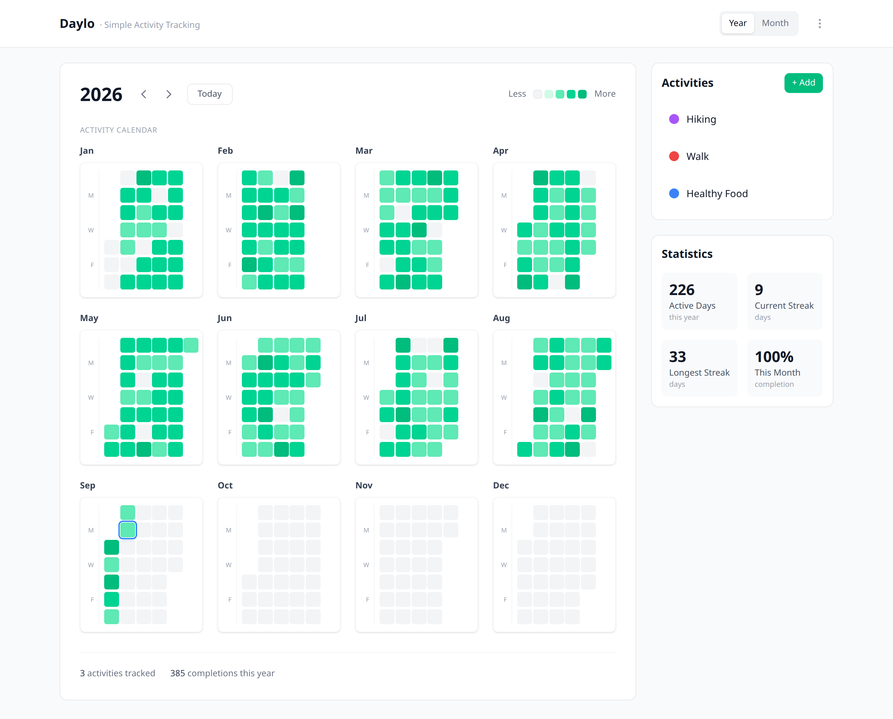
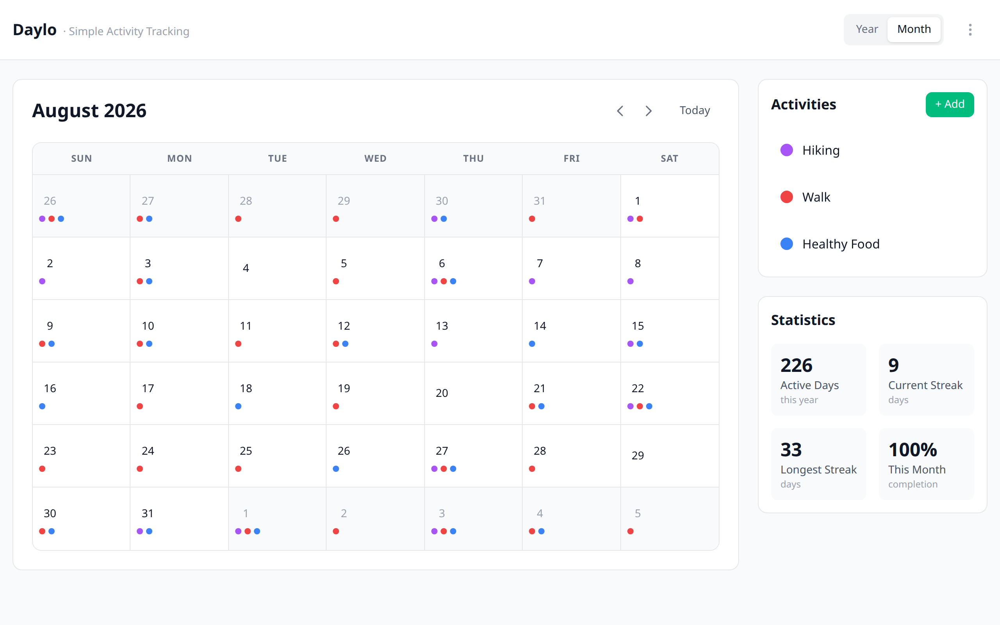
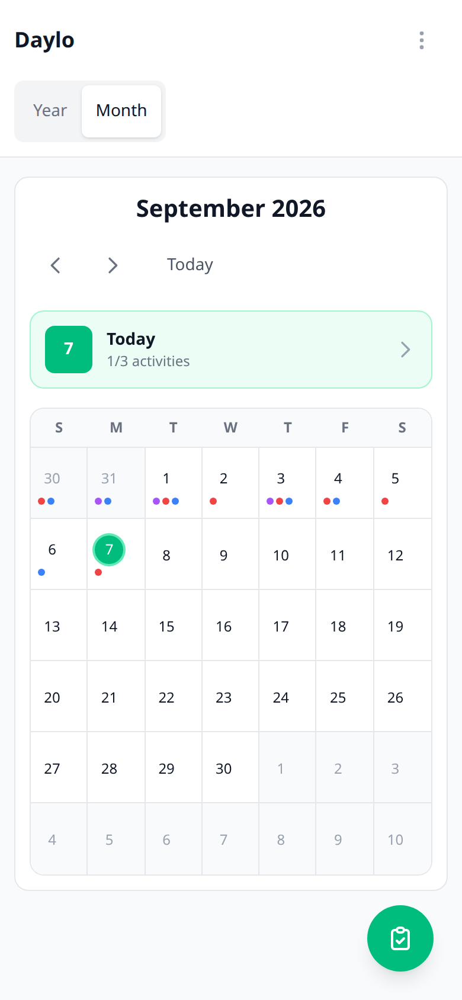

<p align="center">
  
</p>

<p align="center">
  A personal activity tracker with a GitHub-style contribution calendar.<br/>
  Track daily habits, visualize progress with a heatmap, and stay on top of your goals, all locally, no account required.
</p>

<p align="center">
  <a href="#installation">Install</a> &nbsp;&middot;&nbsp;
  <a href="#features">Features</a> &nbsp;&middot;&nbsp;
  <a href="#screenshots">Screenshots</a> &nbsp;&middot;&nbsp;
  <a href="#tech-stack">Tech Stack</a>
</p>

<p align="center">
  
</p>

## Installation

Daylo runs entirely on your device: no account, no cloud, no tracking.

- **[Desktop app](#desktop-app)** (Windows, macOS, Linux): Download from GitHub Releases
- **[Android app](#android-app)** (arm64 phones and tablets): Download the APK from GitHub Releases
- **[Docker](#docker)**: Self-hosted via `docker compose`
- **[From source](#from-source)**: Clone and build

## Features

- **Annual heatmap view**: See your entire year at a glance with a 5-level color heatmap
- **Monthly detail view**: Drill down into any month with activity dots per day
- **Quick daily logging**: Click any day to check off completed activities
- **Activity management**: Create, edit, and delete activities with custom colors
- **Statistics**: Current streak, longest streak, monthly completion rate
- **Export/Import**: Back up your data as JSON or CSV, restore from backup
- **Offline-first**: All data stays on your device, works 100% offline
- **Cross-platform**: Runs as a desktop app (Windows, macOS, Linux) or in the browser

## Screenshots

<p align="center">
  
</p>
<p align="center"><sub>Year view. See your entire year at a glance.</sub></p>

<br/>

<p align="center">
  
</p>
<p align="center"><sub>Month view. Drill down into any month.</sub></p>

<br/>

<p align="center">
  
</p>
<p align="center"><sub>On a phone, the same calendar in your pocket.</sub></p>

## Tech Stack

| Layer | Technology |
|-------|-----------|
| Frontend | React 19, TypeScript, Vite 7 |
| Styling | Tailwind CSS 4 |
| State | Zustand 5 (persisted to localStorage) |
| Desktop & Android | Tauri 2 |
| Testing | Vitest + Testing Library (unit), Playwright (E2E) |
| CI/CD | GitHub Actions |

---

### Desktop App

Download the latest release for your platform from the [Releases](../../releases) page:

| Platform | Direct download (always the latest version) |
|----------|------|
| Windows (x64) | [`Daylo-windows-x64-setup.exe`](../../releases/latest/download/Daylo-windows-x64-setup.exe) |
| Windows (ARM64) | [`Daylo-windows-arm64-setup.exe`](../../releases/latest/download/Daylo-windows-arm64-setup.exe) |
| macOS (Apple Silicon) | [`Daylo-macos-apple-silicon.dmg`](../../releases/latest/download/Daylo-macos-apple-silicon.dmg) |
| macOS (Intel) | [`Daylo-macos-intel.dmg`](../../releases/latest/download/Daylo-macos-intel.dmg) |
| Linux (Debian/Ubuntu) | [`Daylo-linux-amd64.deb`](../../releases/latest/download/Daylo-linux-amd64.deb) |
| Linux (Other) | `Daylo_<version>_amd64.AppImage` on the [Releases](../../releases/latest) page |

Every release from v1.1.1 onward ships a [`SHA256SUMS.txt`](../../releases/latest/download/SHA256SUMS.txt). To verify a download, put it next to the file you downloaded and run:

- **Linux:** `sha256sum -c SHA256SUMS.txt --ignore-missing`
- **macOS:** `shasum -a 256 -c SHA256SUMS.txt --ignore-missing`
- **Windows (PowerShell):** `Select-String -Path .\SHA256SUMS.txt -Pattern (Get-FileHash .\Daylo-windows-x64-setup.exe -Algorithm SHA256).Hash` (replace the file name with the one you downloaded). One matching line means the file is intact; no output means it is not.

Just install and open: no setup, no accounts, no internet required.

#### About the security warning

The desktop installers are not code-signed yet, so your operating system will warn you the first time you open Daylo:

- **Windows** shows "Windows protected your PC". Click **More info**, then **Run anyway**. On a work-managed PC that button can be hidden by policy; ask your administrator.
- **macOS** may refuse to open the app. Go to **System Settings → Privacy & Security**, scroll down and click **Open Anyway** next to Daylo, then enter your password. The button appears for about an hour after your first attempt to open the app; if it's gone, try opening Daylo again first. On macOS 15 and later, right-click → Open no longer bypasses this.

The warning means "unknown publisher", not "unsafe". Every release is built by GitHub Actions from this repository; the [Actions](../../actions) tab shows the run that produced it, and `SHA256SUMS.txt` lets you confirm the file you downloaded is the one it built. A signed Microsoft Store build is on the roadmap.

### Android App

Download [`Daylo-android-arm64.apk`](../../releases/latest/download/Daylo-android-arm64.apk) and open it on your phone. Android will ask you to allow installs from this source the first time. Google Play Protect will then most likely block it with "App blocked to protect your device". **The big button dismisses the install; the small "Install anyway" link below it continues.** Play Protect shows this for any app whose signing key it has not seen before, which is every app installed from outside the Play Store.

- Runs on **arm64 devices**, practically every phone and tablet made since 2017. It will not install on 32-bit devices or on Android Studio emulators.
- Your data lives in the app's local storage on the device. **Use Export Data inside the app before uninstalling**: uninstalling deletes the data.
- **Updating from v1.1.0:** that build was signed with a key that no longer exists, so v1.1.1 cannot install over it. One-time step: Export Data, uninstall v1.1.0, install v1.1.1, Import Data. From v1.1.1 onward, updates install in place.

### Docker

Run Daylo as a local web service with a single command. Requires [Docker](https://docs.docker.com/get-docker/).

```bash
docker compose up -d
```

Open `http://localhost:3000` in your browser.

### From Source

Requires [Node.js](https://nodejs.org/) 20+.

```bash
git clone https://github.com/henfrydls/daylo.git
cd daylo
npm install
npm run dev
```

Open `http://localhost:5173` in your browser.

To build the desktop app from source, you also need [Rust](https://www.rust-lang.org/tools/install):

```bash
npm run tauri:build
```

The installer will be generated in `src-tauri/target/release/bundle/`.

<details>
<summary><strong>Development & Testing</strong></summary>

#### Development

```bash
npm run dev          # Start dev server (browser)
npm run tauri:dev    # Start dev server (Tauri desktop window)
npm run build        # Build for web
npm run tauri:build  # Build desktop installer
npm run lint         # Run ESLint
npm run preview      # Preview production build locally
```

#### Testing

```bash
npm test              # Unit tests (watch mode)
npm run test:ui       # Unit tests with interactive UI
npm run test:coverage # Unit tests with coverage report
npm run test:e2e      # E2E tests (Playwright)
npm run test:e2e:ui   # E2E tests with interactive UI
```

</details>

## Project Structure

```
src/
├── components/
│   ├── activities/    # ActivityForm, ActivityList, QuickLog
│   ├── calendar/      # YearView, MonthView, DayCell
│   ├── data/          # ExportModal, ImportModal
│   ├── stats/         # StatsPanel
│   └── ui/            # Button, Modal, Tooltip, Toast, Icons, etc.
├── hooks/             # useAppVersion, useFocusTrap
├── lib/               # colors, dates, dataExport utilities
├── store/             # Zustand stores (calendar, toast)
├── types/             # TypeScript interfaces
├── App.tsx
└── main.tsx
```

## License

[MIT](LICENSE): free for any use, including commercial.

Releases up to and including v1.1.0 were published under the PolyForm Noncommercial 1.0.0 license and remain available under those terms; everything from this change onward is MIT.
